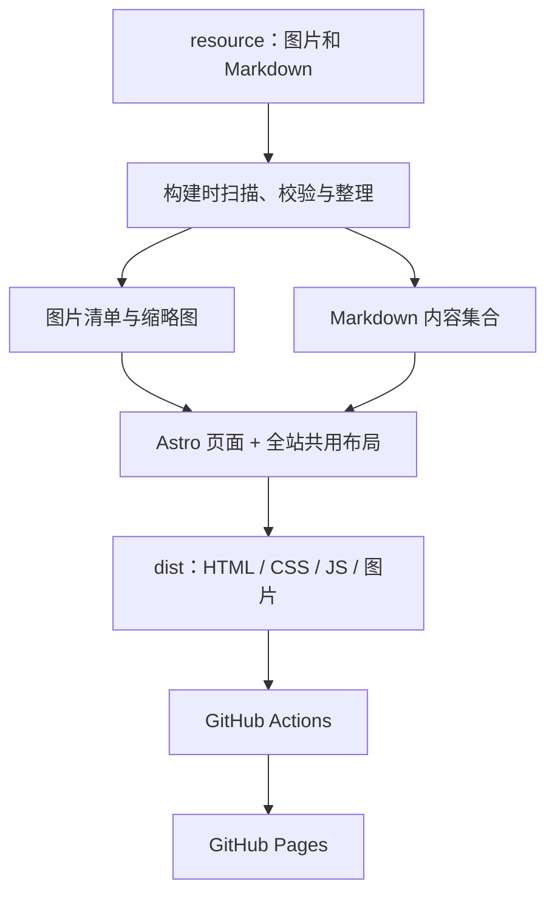

# 个人博客架构设计

本文是第一阶段架构方案，尚未实现页面、资源扫描脚本或部署工作流。

当前工作区的 Git 仓库位于 `Kitazaki-Hinata.github.io/`；下文目录及相对路径均以该仓库为项目根目录。本设计暂存于工作区现有的 README.md。

## 1. 总体方案

采用 **Astro + TypeScript + CSS + 少量浏览器端 JavaScript**，构建静态页面，通过 GitHub Actions 发布到 GitHub Pages。

内容由本地文件维护：图片放入对应资源目录，文章使用 Markdown。所有页面复用一个布局，统一背景、导航、内容容器和页脚。第一阶段不做评论区、登录、数据库或后台编辑器。

GitHub Pages 托管静态文件；本方案在构建时扫描资源目录，再生成列表及详情页。新增文件后，需要提交、推送并等待部署成功，线上内容才会更新。访问者的浏览器不直接枚举服务器目录。部署方式参考 [GitHub Pages 自定义工作流](https://docs.github.com/en/pages/getting-started-with-github-pages/using-custom-workflows-with-github-pages)。



## 2. 栏目与路由

| 栏目 | 路由 | 内容来源 | 展示与交互 |
| --- | --- | --- | --- |
| 主页 | `/` | `resource/about.md` + 站点配置 | 首屏展示名字、简介和栏目入口，下滑进入自我介绍 |
| osu skin | `/osu/` | `resource/osu_skin/` | 按 skin 分组展示预览图片，点击查看大图 |
| 炒股记录与碎碎念 | `/stock/` | `resource/stock_text/**/*.md` | 显示标题、日期、分类和摘要，点击标题进入文章 |
| 文章详情 | `/stock/<文章标识>/` | 对应 Markdown | 渲染正文，提供返回列表入口 |
| 绘画展示 | `/drawing/` | `resource/drawing/` | 响应式画廊，点击查看原图，支持放大、缩小和拖动 |
| 代码项目 | `/projects/` | `resource/projects/**/*.md` | 展示项目卡片、简介、技术标签和仓库链接 |
| 项目详情 | `/projects/<项目标识>/` | 对应 Markdown | 展示项目介绍、截图及可选演示链接 |

主页首屏使用接近一屏的高度，自我介绍紧接首屏；向下滚动或点击“关于我”锚点即可到达。移动端导航折叠，所有栏目保留清晰的返回入口。

## 3. 计划目录结构

以下是待创建的结构，示例文件用于说明内容维护方式。

```text
Kitazaki-Hinata.github.io/
├── .github/
│   └── workflows/deploy.yml       # 构建并部署 GitHub Pages
├── resource/                     # 人工维护的内容源
│   ├── background/               # 全站背景图片专用目录
│   │   └── main.webp
│   ├── about.md                  # 主页自我介绍
│   ├── drawing/                  # 自动扫描绘画图片，支持子目录
│   │   ├── 2026-09-09-example.png
│   │   └── 2026-09-09-example.json # 可选的同名作品说明
│   ├── osu_skin/
│   │   └── my-skin/
│   │       ├── skin.json         # 可选名称、说明、排序和下载链接
│   │       ├── preview-01.png
│   │       └── preview-02.png
│   ├── stock_text/
│   │   └── 2026-09-09-review.md
│   ├── projects/
│   │   └── blog.md
│   └── images/                   # 文章插图、项目截图和头像
│       └── stock/
│           └── example.png
├── scripts/
│   └── prepare-media.mjs         # 扫描图片、生成缩略图及媒体清单
├── src/
│   ├── content.config.ts        # Markdown 集合、加载规则及字段校验
│   ├── config/site.ts           # 名称、导航、背景路径、外部链接
│   ├── generated/media.json     # 自动生成，不手动修改
│   ├── layouts/
│   │   ├── BaseLayout.astro     # 所有页面共用的背景、导航和页脚
│   │   └── ArticleLayout.astro  # 基于 BaseLayout 的文章排版
│   ├── components/
│   │   ├── Header.astro
│   │   ├── Footer.astro
│   │   ├── Gallery.astro
│   │   ├── ImageViewer.astro
│   │   ├── ArticleList.astro
│   │   └── ProjectCard.astro
│   ├── lib/
│   │   ├── content.ts          # 标题回退、排序、草稿过滤、路由标识
│   │   └── urls.ts             # 统一处理部署基础路径和资源 URL
│   ├── scripts/image-viewer.ts # 图片缩放、拖动、键盘和触摸交互
│   ├── styles/global.css
│   └── pages/
│       ├── index.astro
│       ├── osu/index.astro
│       ├── drawing/index.astro
│       ├── stock/
│       │   ├── index.astro
│       │   └── [...id].astro
│       ├── projects/
│       │   ├── index.astro
│       │   └── [...id].astro
│       └── 404.astro
├── public/
│   ├── favicon.svg
│   └── resource/               # 自动生成的公开图片及缩略图
├── astro.config.mjs
├── package.json
├── package-lock.json
└── .gitignore
```

`resource/` 是唯一需要人工维护的内容目录。`public/resource/`、`src/generated/`、`dist/` 是生成产物，加入 Git 忽略规则；`public/` 中的 favicon 等人工文件正常提交。

## 4. 统一背景

- 所有页面（包括文章详情、项目详情和 404）必须使用 `BaseLayout.astro`。
- 背景图片统一放入 `resource/background/`，由 `src/config/site.ts` 指定当前使用的文件，例如 `background/main.webp`。
- 背景目录可以存放多张备选图片，但全站只使用配置中选中的同一张，不按栏目切换。
- 布局负责将背景路径转换为公开资源 URL，页面组件不单独配置背景。
- 使用固定的全屏背景层，图片居中并以 `cover` 铺满；内容层添加统一遮罩和半透明卡片，保证文字可读。
- 图片加载失败时回退到统一的纯色背景。
- 更换背景时替换对应文件，或修改配置中的文件名，再提交部署即可。

## 5. 绘画与 osu skin 图片

### 自动扫描

`prepare-media.mjs` 在开发启动和正式构建前执行：

1. 递归扫描 `resource/drawing/`、`resource/osu_skin/` 的 JPG、JPEG、PNG、WebP、AVIF、GIF 图片，扩展名大小写统一处理。
2. 读取图片宽高及可选的同名 JSON 说明，生成 `src/generated/media.json`。
3. 将图片复制到 `public/resource/` 的对应目录，并为画廊生成缩略图；背景和 `resource/images/` 中的插图也复制到对应公开目录。
4. 媒体清单保存相对路径、缩略图路径、宽高、标题、说明、日期及分组；页面根据清单生成画廊。
5. 不复制 Markdown 或 JSON 源文件；只发布页面实际需要的图片和静态页面。

扫描产物每次完整重建，避免源图片删除后仍出现在列表。清理范围仅限脚本专用的生成目录。开发模式监听资源新增、修改和删除，重新生成清单并刷新页面。

绘画只放图片也能展示：默认标题取文件名，日期优先取可选说明中的日期，其次取文件名开头的 `YYYY-MM-DD`。有日期的作品倒序排列，无日期的排在后面，同日期按相对路径排序；不依赖 Git 检出时会变化的文件修改时间。

可选的 `example.json` 对应 `example.png`：

```json
{
  "title": "夏日练习",
  "date": "2026-09-09",
  "description": "一次光影练习",
  "alt": "树荫下的人物插画"
}
```

osu skin 每个子目录代表一套 skin，目录内可放多张预览图；没有 `skin.json` 时使用目录名作为标题。直接放在 `osu_skin/` 下的图片归入默认分组。下载链接为可选项，不影响图片展示。

### 图片查看器

绘画和 osu skin 共用 `ImageViewer`：

- 列表加载缩略图，保持原始宽高比，延迟加载屏幕外图片。
- 点击后打开大图浮层，初始缩放为适应窗口。
- 提供“放大”“缩小”“适应窗口”“关闭”按钮，缩放范围设为适应窗口比例的 1～5 倍。
- 桌面端支持滚轮缩放、放大后拖动；移动端支持双指缩放和拖动。
- 支持上一张、下一张，切换图片时重置缩放和位移。
- 支持 Esc 关闭、方向键切换，打开时锁定页面滚动并限制焦点在浮层内，关闭后恢复焦点。
- 浏览器端 JavaScript 不可用时，图片链接仍能打开原图。

## 6. 炒股记录与碎碎念

### Markdown → 列表 → 详情页

使用 Astro 内容集合，在构建时通过 `glob()` 读取 `resource/stock_text/**/*.md`。列表读取集合元数据，详情路由通过 `getStaticPaths()` 枚举文章，并使用 `render()` 渲染正文。相关能力见 [Astro 内容集合文档](https://docs.astro.build/en/guides/content-collections/)。

```text
resource/stock_text/2026-09-09-review.md
    → /stock/ 中新增一个标题
    → 点击进入 /stock/2026-09-09-review/
    → 显示对应 Markdown 渲染后的正文
```

详情页生成真实 HTML，直接访问或刷新文章地址也能打开。新增文章无需手动修改列表或注册路由。

### 推荐写法

```markdown
---
title: "今日复盘：耐心等待机会"
date: "2026-09-09"
category: "炒股记录"
tags: ["复盘", "交易心态"]
description: "今天的观察与操作总结。"
draft: false
---

## 今日观察

这里写正文。

## 碎碎念

也可以记录与交易无关的日常想法。
```

字段及回退规则：

| 字段 | 是否必填 | 规则 |
| --- | --- | --- |
| `title` | 否 | 优先使用该字段，否则取正文第一个一级标题，最后回退到文件名 |
| `date` | 否 | 优先使用该字段，否则解析文件名开头日期；仍无日期时显示“未注明日期” |
| `category` | 否 | 建议使用“炒股记录”或“碎碎念”；缺省为“碎碎念” |
| `tags` | 否 | 缺省为空数组 |
| `description` | 否 | 缺省从正文提取一小段纯文本摘要 |
| `draft` | 否 | 缺省为 false；true 时不生成列表条目和详情页 |

完全没有 YAML 头部的普通 Markdown 也必须能展示。元数据字段可选；显式提供但格式错误的日期或字段类型应报出文件名并阻止部署，便于修正。

列表默认按日期倒序，有日期的在前，无日期的在后；同日期按文章标识排序。分类可用于筛选“全部 / 炒股记录 / 碎碎念”。

文章标识由相对路径去掉 `.md` 后规范化生成，保留子目录层级，例如 `2026/review.md` 对应 `/stock/2026/review/`。构建时检测规范化后重名；重命名文件会改变文章链接，因此发布后尽量保持文件路径稳定。

插图放入 `resource/images/`。Markdown 中使用 `` 作为项目约定，渲染阶段统一转换成带站点基础路径的 URL；常规相对路径图片应通过同一处理器解析和校验，避免从文章 URL 错误寻找文件。

## 7. 代码项目与自我介绍

项目使用 `resource/projects/*.md`，复用文章读取和详情页生成机制。每个文件对应一张项目卡片和一个详情页。

```markdown
---
title: "个人博客"
description: "使用 GitHub Pages 展示作品与日常记录。"
tags: ["Astro", "TypeScript"]
repo: "https://github.com/Kitazaki-Hinata/Kitazaki-Hinata.github.io"
order: 1
draft: false
---

## 项目介绍

这里描述功能、实现思路及截图。
```

项目可增加 `demo` 演示地址和 `cover` 封面图片字段；缺少时隐藏对应按钮或封面。按 `order` 升序排列，未指定的排在后面，再按项目标识排序。标题回退和草稿规则与股票文章一致。

`resource/about.md` 维护自我介绍正文。头像、姓名、短简介和社交链接放在站点配置中；不设置的社交链接不显示。

## 8. 构建与发布

计划提供以下命令，当前尚未实现：

| 命令 | 用途 |
| --- | --- |
| `npm run dev` | 准备图片清单、启动资源监听与 Astro 本地开发 |
| `npm run check` | 检查类型、内容字段、文件引用及重复路由 |
| `npm run build` | 准备媒体资源并生成完整静态站点到 dist |
| `npm run preview` | 预览已构建的 dist |

GitHub Actions 在推送到默认分支后执行：检出代码 → 配置与项目兼容的 Node.js → `npm ci` → `npm run check` → `npm run build` → 上传 `dist/` → 发布 GitHub Pages。提交锁文件确保依赖可复现；构建失败则不发布新版本。

按当前仓库名称，计划使用 `https://kitazaki-hinata.github.io/`，Astro 的 `site` 指向该地址，`base` 为 `/`。若以后使用普通项目仓库部署到 `/<repo>/`，需调整 `base`；导航、图片和 Markdown 链接均通过统一的 URL 工具处理。具体配置依据 [Astro 的 GitHub Pages 部署指南](https://docs.astro.build/en/guides/deploy/github/)。

所有本地文件路径可以由系统处理，但生成的网页 URL 统一使用 `/`，路径段正确编码；构建校验文件名大小写，避免 Windows 本地正常、线上找不到文件。

## 9. 日常更新方式

| 想做的事 | 修改位置 | 部署后的结果 |
| --- | --- | --- |
| 更换全站背景 | 替换 `resource/background/main.webp` 或修改背景配置 | 所有栏目统一更新 |
| 修改自我介绍 | 编辑 `resource/about.md` | 主页下方内容更新 |
| 发布绘画 | 向 `resource/drawing/` 添加图片 | 自动加入画廊并支持缩放 |
| 展示一套 skin | 向 `resource/osu_skin/<名称>/` 添加预览图 | 自动加入 osu 分组 |
| 发布炒股记录或碎碎念 | 向 `resource/stock_text/` 添加 Markdown | 自动出现标题和独立文章页 |
| 添加代码项目 | 向 `resource/projects/` 添加 Markdown | 自动出现项目卡片和详情页 |
| 撤下内容 | 删除对应源文件，或将文章设为 `draft: true` | 下次部署移除相应列表和详情页 |

以上更新都需要提交并推送。草稿控制的是站点展示；如果仓库公开，提交到仓库的源文件仍然可被查看。

## 10. 实施顺序与验收

1. 建立 Astro 项目、配置、基础布局、统一背景及响应式导航。
2. 实现主页首屏和下滑自我介绍。
3. 实现股票 Markdown 集合、标题列表、文章详情和项目栏目。
4. 实现图片扫描、绘画及 osu skin 画廊、图片查看器。
5. 接入 GitHub Actions，完成线上验证。

第一阶段验收标准：

- 五个栏目及所有详情页使用同一张背景。
- 新增绘画图片后，无需编辑页面代码即可在下一次构建中展示。
- 新增无元数据的 Markdown 也能显示标题、进入正文，直接刷新文章链接正常。
- 同名图片位于不同子目录时可正常展示；删除文件后生成清单不残留。
- 图片放大、缩小、拖动及移动端触摸操作正常，关闭浮层后页面恢复滚动。
- 空栏目显示友好的占位内容，非法内容配置提供可定位的构建错误。
- 用户站点根路径和项目站点子路径下的导航、图片及文章链接均正确。
- 不提供评论区。

