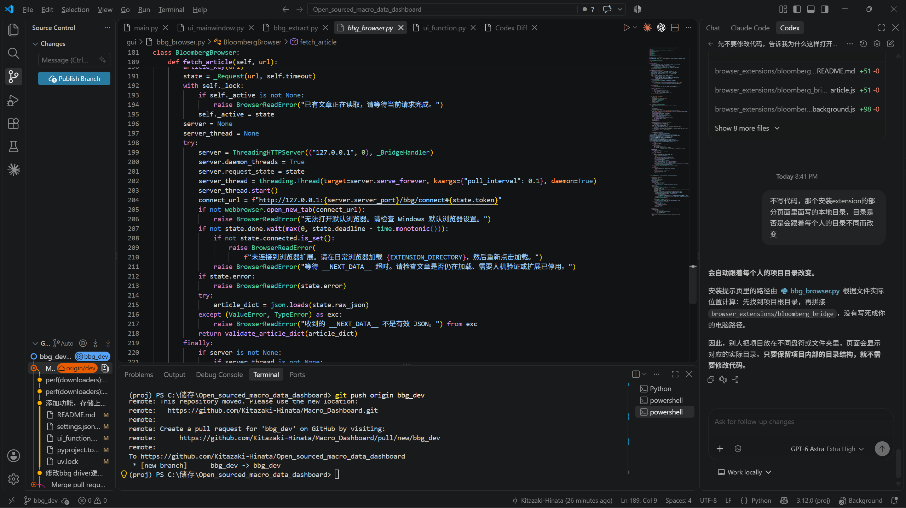

周末几个AI大手子发声要AI竞赛降温，夜盘时整个大盘表现非常糟糕，NAS100盘前下跌1.6%，此外本周RSP标普等权也跌破了之前的回踩支撑位；
油价重新站回100美元关口，那么之后的CPI数据估计又会很难看了。目前市场计价今年年末之前加息2次25bp，大概率确定接下来小半年不会有牛市行情了。
今晚这个行情或许开盘后会有一些修复，但是也不是很想做交易。

现在这个市场的多头很脆弱（尤其是各种AI硬件），对于各种利好消息都不敏感，尽管个股基本面几乎没有什么问题，反而是市场有点风声就开始找机会抛售。
既然多头力量拼尽全力也没有办法赚钱，那么后续大概率会在利空消息的推进下出现多杀多的行情。届时出现插针行情之后抄底做波段，或许才是更简单的做法。
**保持自己的判断，选择大于努力。在胜率高的行情多做，胜率低的行情少做，不要认为自己是天才。**

接下来是重新维护了一下之前做的macro dashboard项目里面抓取Bloomberg文章的部分

之前抓取BBG文章，采用selenium去新建浏览器，但是发现selenium新建的浏览器对于个人信息收集不全，所以总是能导致识别上机器人操作
但是原本抓取的方式是没有问题的，也就是通过提取对应文章的隐藏json文件然后重新排版。
所以让GPT 6重新写了一个不用selenium，用本地浏览器插件实现访问后端json的方式。
**nm的就你那个破bloomberg文章对炒股一点作用没有还敢要200块一个月，就是要狠狠薅资本主义的羊毛**
