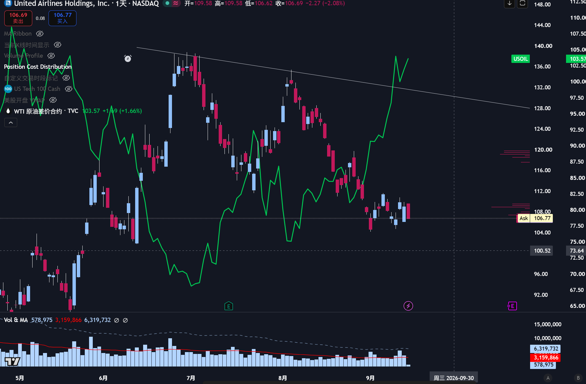

市场油价开始接近前高，但是k线在105-110附近开始犹豫；
而美国航空和美联航的走势自从26年开年以来就是与油价强负相关关系。
可以尝试做多这些股票，交易后续一个月当中潜在的事件引发油价下跌。
今天继续加仓美联航，卖了美联航的OTM PUT，以及买了美国航空的ITM CALL。
如果要是两周涨不上去减持；跌破位去掉期权换部分正股，但仍然降低整体仓位。

这个策略最大的风险就是股价与油价脱锚，因为当前所有板块的票都在下跌，航空股可能会受到大盘的影响跌破位，所以要做止损。希望这次不要再是“正确的止损”了。

不知道算不算大盘报复我不好好复盘和研究股票，每次都是稍微浮盈一点然后来个消息就给我浮盈变浮亏迫使我止损。尽管每次都是正确的止损但是来回震荡也磨损了一小部分的本金。

另外今天还稍微研究了一下量化，试图把之前做t的那套视觉方法写成死规律，感觉还是太难了，没有什么进展。脑子太笨了呜呜呜