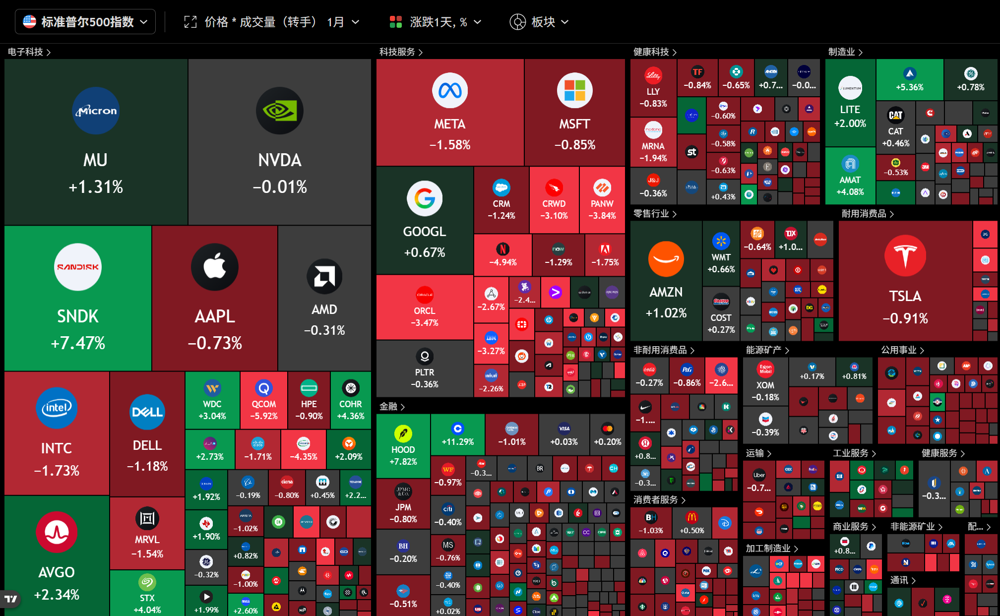

经典大盘高开低走，整个大盘都表现得很糟糕；不过今天比特币莫名拉升5%，所以coinbase，HOOD, MSTR这些都拉了十厘米左右。然后比较意外的是，闪迪也走出了强于大盘的走势。

昨天闪迪横盘后拉升4-6%的时候，就感觉闪迪的强度不太一样，可能又要走一个波段了，今天也算是运气很好，市场真的就拉升上去了，尽管大盘和存储板块都表现得很糟糕（比如美光涨了3%之后就来回上下针然后变成1.5%）。**闪迪还是存储板块的龙头，而且他的估值也比美光低（美光13PE，闪迪7PE），所以拉升闪迪也是情有可原（当然，不是因为估值低拉升，而是横盘时间够了该拉升了）。**

接下来一段时间或许会走这种阶段性的机会，也就是缅a常说的“结构性牛市”，因为整体市场的流动性开始收紧，资金只会集中在几个特定的题材/板块上面。而其他大部分股票只有做小波段或者t+0的机会。

今天做的最好的地方就是发现闪迪买盘强度强于大盘的时候没有手痒痒抛售（例如，大盘下跌，美光下跌，闪迪只是横盘）。闪迪的股性之一就是，一旦前半夜上涨，后半夜大概率不会冲低，除非有事件影响。尽管不能确认下周一会如何表现，但至少这次大胆拿住被验证似乎是正确的。另外，亏了笔手续费的清掉了美国航空的ITM CALL，因为今天WTI油价跌了4%之后航空股没有反应（虽然BRENT OIL没有下跌），可能市场对于航司股的交易逻辑从之前的油价反指转变为了高油价担忧业绩的逻辑，所以适当减持航司类标的，留有美联航的正股和sell OTM PUT & OTM CALL吃theta。