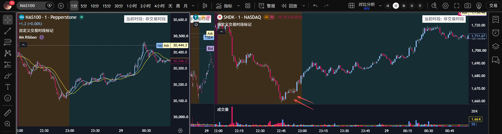

昨天开盘后开始一路下挫。不过昨天莫名的运气很好，无意发现了一个从没研究过的票，MongoDB，开盘的时候跌-25%，以为是财报出问题了去看了看，结果发现不是财报日。再次确认后发现原来是MDB下跌是因为CEO被meta挖走了。于是开盘买入15%的仓位，昨天一天就有7%的收益。这种机会真的是可遇不可求，上一次遇到还是几个月前国内证监会对futu等中国人多的美股券商罚款时的那一个机会。那次盘前futu跌-40%，因为没有研究过基本面所以没敢抄底，后续几天就涨了40%，错失了一个很好的机会。当然，这种机会在futu之前也有，也抓到并且吃到过肉。对于这种机会，通常来说最大的心里障碍是**没有研究过基本面**，所以有的时候需要克服这样的问题。此外，下次再遇到的时候仓位可以再大一些。

其他方面，昨天SNDK跌到1670的时候出现了很多上影线，感觉要反弹了，结果刚要下单瞬间拉升上去了，没买进去，错失了一笔很好的交易机会，算是手慢无了。

